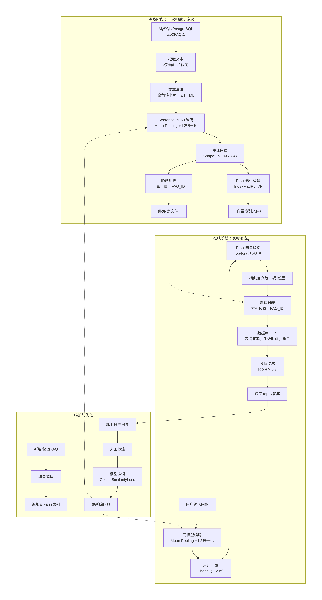

# 基于BERT的文本编码与相似度计算技术方案

---

## 一、方案核心思想

**不采用原生BERT的句子对交互式匹配，而是采用Sentence-BERT双塔架构，将文本编码为向量，通过向量检索计算相似度。**

| 对比维度 | 原生BERT（错误做法）    | **Sentence-BERT（本方案）** |
|---------|-----------------|---------------------------|
| 输入 | 句子对 `(A, B)` 拼接 | 单个句子 |
| 在线计算量 | O(N)，N=FAQ总数    | O(1)，1次编码 |
| 100万FAQ响应时间 | >30秒（GPU）       | **<50ms（CPU）** |
| 是否可工业落地 | ❌ 不推荐           | ✅ 主流方案 |

---

## 二、技术架构流程图

---

## 三、关键技术步骤（语言描述）

## 三、关键技术步骤（语言描述）

### 第一阶段：离线向量化

**1. 数据准备**
- 从数据库读取所有**生效中**的FAQ
- 对每个FAQ，提取**1条标准问** + **最多200条相似问**
- 建立映射表：每一条文本 → 所属的`faq_id`

**2. 文本清洗（适度原则）**
- 全角符号转半角（英文、数字）
- 去除HTML标签（如有）
- 去除首尾及多余空白
- **严禁**：分词、停用词过滤、转小写（中文无意义）

**3. BERT编码（核心步骤）**
- 加载中文预训练Sentence-BERT模型
- 将文本按批处理（batch_size=64~128）送入模型
- **每个字**经过12层Transformer，融合上下文信息
- **Mean Pooling**：对所有字的向量取平均值，得到句子向量
- **L2归一化**：将向量模长变为1，使余弦相似度=向量点积

**4. 索引构建**
- 使用Faiss创建向量索引
- 数据量<10万：`IndexFlatIP`（精确检索，100%召回）
- 数据量>10万：`IVF`倒排索引（聚类加速，精度损失<1%）
- 保存索引文件到磁盘，支持服务重启加载

---

### 第二阶段：在线检索

**1. 用户问题编码**
- 接收用户输入，执行**完全一致**的清洗逻辑
- 调用**同一个BERT模型**，Mean Pooling + L2归一化
- 输出768/384维用户向量

**2. 近似最近邻检索**
- 将用户向量送入Faiss索引
- 索引返回Top-K个最相似向量的**位置索引** + **余弦相似度**
- 检索耗时：<10ms（CPU），<2ms（GPU）

**3. 业务映射与过滤**
- 通过映射表：位置索引 → FAQ_ID
- 数据库查询：`SELECT * FROM faq WHERE id = ?`
- 生效时间判断：当前时间是否在`effect_start_time`和`effect_end_time`之间
- 相似度阈值过滤：通常设为0.65~0.75

**4. 结果返回**
- 按相似度降序排序
- 返回FAQ答案、标准问题、相似度分数

---

### 第三阶段：维护优化

**1. 增量更新**
- 新增FAQ：仅对新文本编码，append追加到Faiss索引
- 更新FAQ：标记旧向量失效，添加新向量
- 删除FAQ：无需删除向量，数据库查询时过滤即可

**2. 模型微调（可选）**
- 积累10,000+条用户真实Query + 人工标注的正确FAQ
- 构造三元组：`(query, 正例FAQ, 负例FAQ)`
- 使用`CosineSimilarityLoss`微调SBERT
- 领域适配后召回率提升15%~25%

**3. 降级兜底**
- 向量检索结果为空或分数过低
- 降级至BM25全文检索
- 仍无结果 → 转人工或返回默认提示

---

## 四、方案核心优势

| 优势 | 说明 |
|------|------|
| **语义理解** | BERT解决了字面不匹配问题，“退款”≈“退钱” |
| **响应速度** | 离线编码一次，在线仅需1次推理+向量检索 |
| **硬件成本** | CPU可部署，无需GPU集群 |
| **可扩展性** | 支持百万级FAQ，响应时间对数增长 |
| **可解释性** | 相似度分数直观，映射关系清晰 |

---

## 五、常见误区澄清

**❌ 误区1：用BERT必须拼接句子对**

这是学术界做法，工业界不用。我们是用BERT做**编码器**，不是做**分类器**。

**❌ 误区2：向量检索不需要数据库**

向量只知道“像不像”，不知道“对不对”。数据库提供答案、生效时间、权限控制——**缺一不可**。

**❌ 误区3：必须用最大模型**

`bert-base-chinese`（12层，110M参数）太大。`MiniLM`（12层，22M参数）速度翻5倍，精度掉1%，**优先选轻量级**。

---

## 六、一句话总结

将BERT作为“语义翻译官”，把所有人话翻译成向量； 再通过向量搜索引擎找邻居；最后用数据库补齐业务属性。这是工业界FAQ问答的成熟范式，兼具语义理解能力与高并发性能。